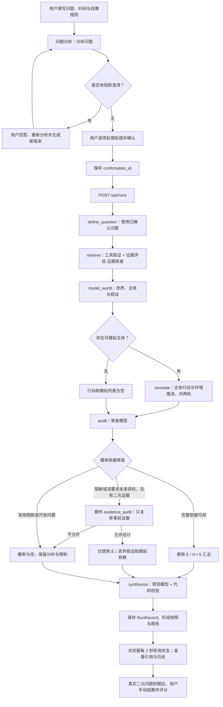
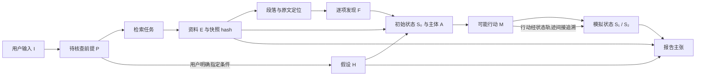
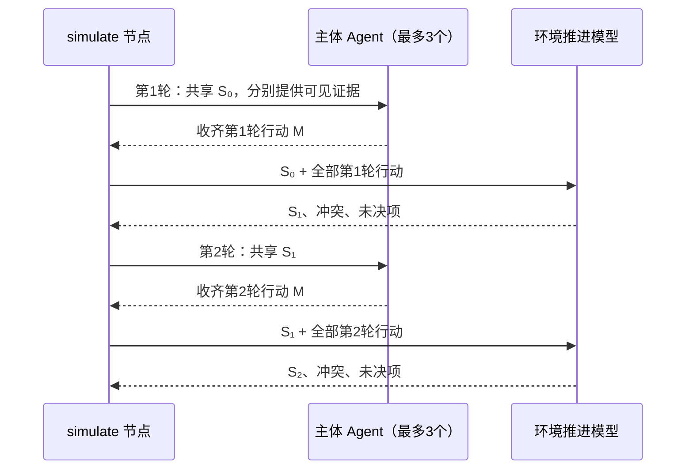

# ForecastLab：完整 Agent 工作流说明

核对日期：2026 年 10 月 7 日。本文依据实际源代码整理，而非把工程计划当成运行事实。

运行地址：http://localhost:8765 。实际工程目录为 `C:/Users/admin/Documents/Codex/2026-10-07/task/forecastlab`；桌面 `multiagent预测` 目录保存了早期工程计划和研究资料。本文件同时保存到两处，方便找到。

## 1. 项目解决什么问题

用户提出一个可结算的二元问题，或一个开放情景问题。系统先明确问题与前提，再核查证据、构建世界状态、模拟主体行动、审查判断，最后给出带引用的报告。概率是当前证据和建模条件下的主观判断，并非经过训练或统计校准的真实频率。

“多个 Agent”主要指不同职责、提示词、输入权限和结构化输出，共用一个模型适配器，并非多个独立训练的模型。主体 Agent 只在每轮推演中并行；主流程由 LangGraph 固定顺序编排。

首次体验有两个入口：“运行教学演示”直接执行旧版固定样例全流程；“分步体验：问题与证据”让用户亲自经历新版问题分析、澄清、前提确认和逐项证据发现。两者都是虚构材料和固定输出，无需密钥，不能据此证明模型效果。

## 2. 总体调用关系

图中 evidence_audit 的触发条件由代码控制；即使审查模型不通过，系统也不自动把模拟结论升级为事实。开放问题输出情景分析，概率为空。

## 3. 各角色的输入、处理与输出

| 角色 / 节点 | 读取什么 | 做什么 | 输出与限制 |
| --- | --- | --- | --- |
| 问题分析 / question_framing | 用户原话、已有日期和规则、补充回答、上一版本 | 区分研究问题与解释，识别前提，提出必要澄清和最多 3 个检索任务 | QuestionFraming；I 输入、P 前提、C 澄清、检索计划。不能编造来源或悄悄改用户给定字段 |
| 用户确认 / QuestionService + RunStore | 当前草稿版本和逐项前提决定 | 每项选择“保留并核查”“指定情景条件”或“不采用” | 不调用模型；存不可混淆的版本和 confirmation_id；过期版本冲突返回 409 |
| define_question | 已确认 QuestionSpec 与 framing | 生成运行内问题分析与查询；新流程直接沿用已确认检索计划 | QuestionAnalysis。旧版在线入口可能调用 question 模型；旧版导入 / 复用无需该调用 |
| 取证工具 / sources.py | 截止时间、查询计划、导入包或父运行 | 在线 Tavily 查询或导入；过滤、同源归组、选材、保存正文快照和段落 | RetrievalResult：E 证据、查询日志、排除项、状态；工具负责取得资料，不由模型凭记忆补来源 |
| 证据评估 / evidence_assessment | 活动前提、取得的原文段落与来源元信息 | 将逐项发现关联到前提，保留支持 / 挑战 / 背景、冲突和缺口 | EvidenceAssessment：F 发现及精确引文。代码验证 E、hash、段落、逐字 quote，定位字符偏移；不输出概率 |
| 世界建模 / world | 问题、证据及评估、活动前提 | 建立 S₀ 变量、主体目标与约束、H 假设 | WorldState；主体最多 3 个，可为 0。用户情景条件映射到 H；模型提出的假设不能伪装成用户指定 |
| 主体行动 / actor | 当前轮初始状态、自己的主体画像、获准可见的证据 | 每个主体提出一个可能行动及理由、影响和条件 | ActorAction，编号 M轮次-主体；同轮并行，均读同一状态；不直接写下一状态 |
| 环境推进 / environment | 当轮全部行动与状态变量 | 联合处理相互影响、冲突、未决项，产生下一状态 | SimulationStep：S₁ / S₂；只更新已有变量键，新变量留在未决项；模拟不能当作真实发生 |
| 审查 / review | 问题、E、世界状态、两轮行动与模拟 | 检查证据支持、反证遗漏、模拟跳步，最多 5 项关键问题 | Review：状态、issues、probability_basis。严重问题或无依据主张阻断；代码排除要求未来结果作事前证据的错误 |
| 证据复审 / evidence_audit | 仅问题与外部证据评估 | 在特定阻断路径判断是否仍可给有保留的事前概率 | EvidenceOnlyAudit；不读模拟与世界假设。通过后 probability_basis=evidence_only |
| 预测汇总 / forecast | 完整审查材料，或严格只使用 E 的材料 | 给出结论、支持与反对主张、主观概率、局限 | Forecast；代码校验引用、选项、0–1 范围与合计。开放问题、空证据和无可用依据时概率为空 |
| 结算 / API 代码 | 到期真实二元运行、用户填的实际结果和来源 | 保存结果，按原概率计算二元 Brier | Settlement；不修改原预测，不自动抓取结果。单次评分不等于概率已校准 |

旧版 evidence 节点只检查来源编号及汇总，不具备新版所有逐项引文约束。前端会明确显示“旧版记录未包含问题理解 / 逐项发现”，不会伪造确认历史。

## 4. 数据身份与引用链

输入 I 是用户真实提交文本；前提 P 是从输入识别的解释，需要用户决定如何处理；发现 F 是对原文的组织结果。F / P 本身不能充当外部证据引用。

E 是外部资料（教学模式则明确标成虚构）；H 是用户条件或模型假设；A 是主体；M 是模拟行动；S 是状态与环境推进结果。最终主张字段引用 E / H / S，页面允许点开检查，代码验证编号存在。M 行动进入模拟轨迹并由 S 的 parent_ids 追溯；当前 forecast 的 simulation_ids 校验集合来自 SimulationStep（S），不能把 M 当成可直接写入该字段的有效编号。存在编号只保证可追溯，不自动保证推理正确。

日期字段需要分清：published_at 是来源发布日期，updated_at 是更新日期，event_at 是内容事件日期，retrieved_at 是实际取得资料时间。仅发布日期早于截止日，并不能证明网页内容在当时已冻结。在线资料保留日期未知和可得性未验证身份；历史 exercise 资料允许按早期发布日期整理，但注明事后整理和回看偏差。

原文快照、来源组、段落、hash、偏移用于查证；正文截断和搜索片段限制会随发现进入上下文。模型读取有长度上限，完整存储内容和给模型的节选并不等长。

## 5. 两轮推演的真实执行顺序

每轮先复制当前状态，并行调用最多 3 个 actor。所有主体完成后，environment 一次读入当轮全部行动，产生状态变更、冲突与未决项。下一轮只在此后开始。主体不是轮流抢先修改状态，也不是互相对话直到达成共识。

无主体时 simulate 节点仍执行，但返回空行动与空模拟。流程继续审查和汇总；该分支不是运行失败。

## 6. 概率如何产生

现有实现由 forecast 模型依据给定材料直接估计概率，随后通过确定性校验。没有实现显式情景树的叶子概率求和、蒙特卡洛频率统计、多个独立预测者加权合成或统计后处理校准。工程计划中讨论这些方法，不代表当前代码使用它们。

完整依据路径允许引用建模与模拟；evidence_only 路径清空世界假设和模拟上下文，并移除 H / S 引用与关键假设，只保留 E 支撑的主张。无证据不能给概率。市场问题额外提供期限与价格资料覆盖，避免用一两天行情直接外推月末，并在资料覆盖不足时加局限说明。

forecast 的业务校验最多尝试两次模型汇总；仍不合格时执行保守修复，移除无效引用和无依据主张，必要时清空概率。底层模型结构修复与网络重试也可能消耗调用预算，不能把一次业务节点理解为恰好一次 HTTP 请求。

## 7. 持久化、预算、失败与恢复

RunStore 使用 SQLite 保存运行索引和 JSON 记录，以及问题草稿、修订、确认、模型调用、分析操作；运行目录保存阶段 JSON 快照，证据系统保存原文快照。当前 save 会按阶段名覆盖同名文件，不能把这些阶段文件声称为无限追加、不可覆盖的事件日志。结算保存到运行记录但不重写阶段快照。

execute 每完成一个图节点，将输出写入 stage_outputs，并更新 RunRecord、耗时与当前阶段。simulate 内两轮合在一个图节点输出，第一轮不是独立的 LangGraph 恢复检查点。

运行状态从 queued 到 running，最终可能为 completed、scenario_only、insufficient_evidence。异常分别产生 partial（预算达到上限）、failed（证据阶段错误或其他异常）、interrupted（服务重启时标记未结束运行）。失败记录保留已有产物和错误，前端显示受阻阶段，可通过 resume 继续。

resume 从第一个缺少阶段输出的节点开始，恢复前面阶段状态，保留 retry_history、resume_count 和已有用量。已生成完整报告不能恢复；失败、部分完成、中断才可恢复。在线取证已开始却中断时，不在同一运行无限重复检索，要求新建运行。恢复不保证外部供应商请求 exactly-once，也没有每个主体调用级的自动缓存复用。

默认总调用上限为 18，活动时限 300 秒（可由环境配置修改）。新版问题准备阶段最多 6 次调用，准备耗时和调用会纳入新运行剩余预算；用户等待 / 编辑时间不作为模型活动时间。实际 HTTP 超时为 45 秒；网络类错误最多 3 次尝试并退避，结构错误最多一次底层修复。新版 问题分析与证据评估 还在服务层管理共享修复额度，避免无界重试。预算在请求前检查，已经发出的请求仍可能跨过时限。

服务通过进程内 Lock 限制同时一个运行，忙时返回 409。不是多进程可靠任务队列，不应直接用多个 worker 获得安全并发。浏览器关闭不会取消已启动后台任务；当前没有取消 API。

## 8. 前端怎么映射工作流

| 视图 | 用户要完成的任务 | 对应内容与状态 |
| --- | --- | --- |
| 创建预测 | 定义问题、确认解释、选择证据并提交 | 时间与结算规则、分析模式、问题分析 澄清与前提决定、确认后开启运行；教学入口区分分步体验与完整演示 |
| 证据与模型 | 检查资料是否真的支持解释 | 证据评估 逐项发现与筛选、精确引文、来源限制、E 列表、S₀ 变量、H 假设、相关主体；引用抽屉加载并验证快照 |
| 推演过程 | 理解执行到哪一步、状态怎样变化 | 六阶段记录、两轮切换、主体行动、环境状态变更、冲突与未决项、审查意见、失败和恢复入口 |
| 结果与历史 | 阅读预测、核对理由并回放 | 结论和主观概率、完整 / 仅证据依据标签、支持与反对主张、局限、运行元数据、历史、JSON / HTML 导出、到期结算评分 |

前端读取 /api/health、/api/examples、/api/runs 和结算汇总。运行中每 2 秒 GET /api/runs/{id}，完成后刷新历史。实现的是 HTTP 轮询，未实现 SSE 事件流与 Last-Event-ID 重连协议。刷新页面读取历史记录，可以再选择已有运行，不会把它当成实时事件日志播放。

## 9. API 与代码入口

问题分析：POST /api/questions/analyze；读取草稿：GET /api/questions/{draft_id}；确认：POST /api/questions/{draft_id}/confirm。旧版 /api/questions/parse 仍可用，旧版直接传 question 的运行接口仍保留，所以不能声称所有 API 调用强制先经新版用户确认。

创建 / 列表：POST /api/runs、GET /api/runs；详情 / 恢复：GET /api/runs/{run_id}、POST /api/runs/{run_id}/resume；证据 / 评估 / 原文段落：对应 evidence、evidence-assessment、evidence/{id}/passages；导出：export?format=html 或 json；结算：POST /api/runs/{run_id}/settlement；汇总：GET /api/settlements/summary。

主要源文件（相对上述实际工程目录）：

- backend/app/api.py：接口、后台任务、单运行锁、报告导出与结算。
- backend/app/graph.py：图顺序、建模、两轮推演、审查、概率分支、输出校验与恢复。
- backend/app/agents/question.py、question_service.py：问题分析 与版本化问题服务。
- backend/app/agents/evidence.py、sources.py、provenance.py：证据评估、取证和精确来源验证。
- backend/app/schemas.py、storage.py、llm.py、config.py：数据契约、持久化、模型传输、预算。
- frontend/src/App.tsx、components/：四个视图、轮询、确认、发现、引用抽屉。
- eval/：固定案例、单 Agent / 基线、运行与评分 CLI；有这些脚本不等于已经证明框架优于基线。

## 10. 已实现与仍属计划的边界

已实现：固定顺序图、新版问题确认、逐项发现与精确原文引用、受限主体并行、两轮环境推进、审查和证据降级分支、概率与引用校验、持久化、恢复、版本与历史、导出、用户手动结算与 Brier、评估脚本。

未在现有图中实现：审查后返回 world / simulate 的业务返工边、先写完整报告再 Critic 再模板发布的闭环、显式情景树概率合成、蒙特卡洛校准、独立校准模型、SSE、取消接口、多进程任务队列、自动结算。现有审查发生在 forecast 之前；报告输出校验不是一次额外 Critic 对完整报告的审查。

历史事件存在模型预训练知识和事后网页修改污染风险，日期与快照规则不能消除这些问题。共用模型的主体错误可能相关；模拟更丰富、Agent 更一致，都不能自动证明概率更准确。

## 11. 建议的首次走读顺序

先点“分步体验：问题与证据”，点击“分析问题”，回答正式版 / 测试版澄清（教学填写“可下载的正式版”），逐项选择前提处理，再确认并开始预测。到证据页核对发现与原文高亮，到推演页比较两轮状态，最后到结果页核对概率依据、支持 / 反对主张和局限，并导出记录。

真实运行需配置模型密钥；在线检索另需 Tavily 密钥。2026-10-07 核查时，本地服务显示模型密钥未配置，因此本次真实渲染验收采用无付费教学路径，不能声称已验证实时模型预测或联网取证质量。
